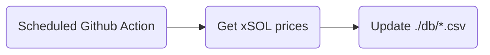

#  Solana APY SDK

This GitHub repository provides an SDK for calculating Annual Percentage Yield (APY) and a database of prices for major Solana stake pools. The purpose of this repository is to unify the calculation of APY across various Solana stake pools and simplify the process for developers to incorporate APY calculations into their Solana-based projects.

## Usage

Install the package:
```bash
pnpm install @glitchful-dev/sol-apy-sdk
```

```typescript
import { fetchAndParsePricesCsv, calcAverageApy, DATA_SOURCE } from '@glitchful-dev/sol-apy-sdk'

(async () => {
  const prices = await fetchAndParsePricesCsv(DATA_SOURCE.MARINADE_CSV)
  const apy = calcAverageApy(prices)

  console.log(apy) // 0.06267310505366575 => 6.267 %
})()
```

## Prices DB
A Github action runs periodically and collects prices of some of the stake pools' tokens. The prices are stored in CSV files.



This SDK can fetch the contents of these CSV files and calculate APY based on this data.
The data is collected at the same time for all target stake pools.
The SDK calculates the APY in the same way for everyone.
This ensures fairness for stake pool users who are then given an opportunity to compare how stake pools perform.
